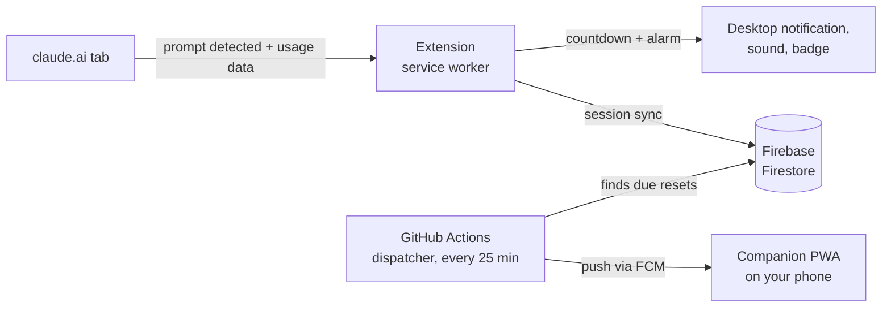

<div align="center">

# ⏰ Claude Reset Notifier

**Know the moment Claude is ready again.**

A Chrome extension that tracks your Claude usage window automatically and pings you on desktop *and* phone the second your limit resets, so you stop checking back and start working again.


</div>

---

## The problem

Claude works in rolling usage windows. When you hit the limit, you drift off to email or the browser, and the reset comes and goes without you noticing. That's lost working time, every single day.

## The fix

Claude Reset Notifier watches your session in the background and tells you, loudly and on every device, the moment you can start again.

- 🔍 **Automatic session detection.** Starts tracking when you send your first prompt on claude.ai. No buttons, no timers to set.
- ⏳ **Live countdown.** Click the toolbar icon to see exactly how long until you're back.
- 🔔 **Desktop alerts with sound.** A notification plus your choice of bell, chime or digital tone.
- 📱 **Phone push notifications.** A companion web app (PWA) delivers the alert to your phone, even when your laptop is closed.
- 🔁 **Smart reminders.** Missed the first alert? Get reminded every 5, 10, 15, 30 or 60 minutes until you're back.
- 🏷️ **Icon badge.** See your status at a glance without opening anything.
- ☁️ **Synced across devices.** Sign in with Google and your session follows you.

## How it works



1. A content script on claude.ai detects your first prompt and reads the official usage window, so the countdown matches Claude's real reset time instead of a guess.
2. The service worker stores the session, schedules a Chrome alarm that survives browser restarts, and fires desktop alerts when the window resets.
3. The session syncs to Firestore under your own account (per-user security rules).
4. A lightweight serverless dispatcher runs on GitHub Actions, finds sessions that are due, and sends a push notification to your phone through Firebase Cloud Messaging.

## Tech stack

| Part | Built with |
| --- | --- |
| Browser extension | TypeScript, Chrome Manifest V3, React (popup + options), Vite |
| Phone app | React PWA, Firebase Cloud Messaging (web push) |
| Backend | Firebase Auth (Google sign-in), Cloud Firestore |
| Scheduler | GitHub Actions cron + Node.js dispatcher |
| Monorepo | pnpm workspaces with a shared types package |

## Project structure

```
apps/
  extension/        Chrome extension: detector, service worker, popup, options
  companion-pwa/    Phone app that receives push notifications
dispatcher/         Sends due phone notifications (runs on GitHub Actions)
packages/shared/    Shared types and constants
firebase/           Firestore rules, indexes and config
```

## Getting started

Full step-by-step instructions (Windows) are in **[SETUP-GUIDE.md](SETUP-GUIDE.md)**. The short version:

```bash
pnpm install
cp apps/extension/.env.example apps/extension/.env.local   # add your Firebase config
pnpm build:extension
```

Then open `chrome://extensions`, turn on **Developer mode**, click **Load unpacked** and choose `apps/extension/dist`.

## Privacy

- The extension only runs on `claude.ai`.
- It never reads or stores your conversations. It only tracks *when* your usage window started and when it resets.
- Your session data lives in your own Firestore record, protected by per-user security rules.

## Status

`v0.1.0`, built for my own daily use and used every day. Roadmap: Chrome Web Store release, Firefox support, and a one-click install for the phone app.

---

<div align="center">

Built by **[Siddharth Singh](https://www.linkedin.com/in/siddharth2025)**

<sub>Independent project. Not affiliated with or endorsed by Anthropic.</sub>

</div>
